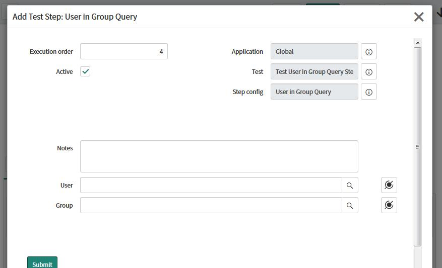

# User in Group Query

## Description

Selects a user based on Group membership.  Perform a database query to verify if a user matching the conditions set in this test step exist. If no user specified in the condition, the first user in the group is returned.

## Inputs

User (u_user) - Reference  
Group (u_group) - Reference 

## Outputs

User (u_user) - Reference  
Table (u_table) - Table Name

